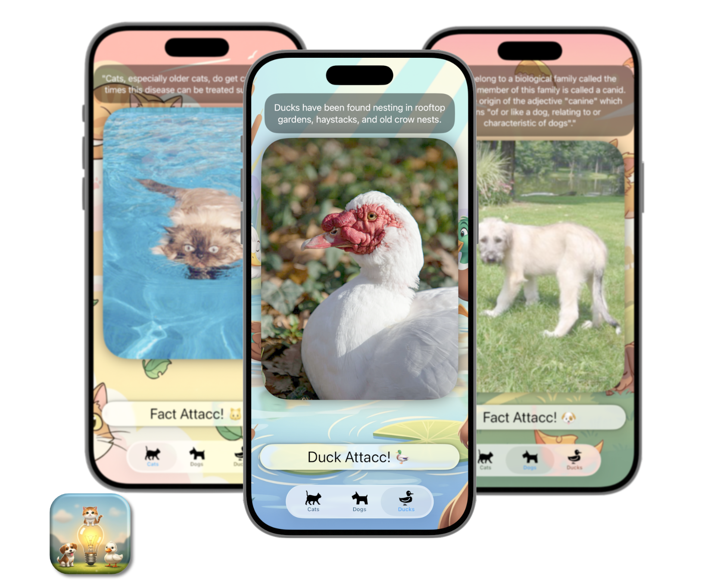

<h2 align="center">
  ✨ Fact Attack! 🐾 ✨
    
  

</h2>

## Table of Contents

- [Description](#description)
- [Motivation](#motivation)
- [Built with](#built-with)
- [Concepts explored](#concepts-explored)
- [Preview](#preview)
- [To-do](#to-do)

## Description

Fact Attack! is a lightweight app that delivers random images and facts about cats, dogs, and ducks, with the tap of a button. Using multiple APIs, instantly fetches a fresh picture and an interesting "facto" for the selected animal. Navigation is handled through simple TabViews, letting you switch seamlessly between your favorite animal.

## Motivation

So i made Fact Attack! because obviusly i love these animals, but also, combine that with my journey in learning SwiftUI development. This project was the opportunity to practice asynchronous API calls, explore the MVVM architecture, work with URLSession for networking, and use JSONDecoder() to handle data parsing to name a few.

## Built with

- SwiftUI
- Xcode 16.4

## Concepts explored

TabView • .sensoryFeedback() • JSONDecoder() • Async API Calls • Async Image Loading • task() • do-catch • Access Control • MVVM • @Observable • @MainActor • Privacy • get/set • Separation of Concern etc

## Preview

## To-do

- [x] ~~Fix Duck icon 🦆 in TabView (dark mode appears too dark).~~
- [ ] Replace default ProgressView with a custom loader or something else.
- [x] ~~Add animation and improved styling to the main button.~~
- [ ] Add an “Info” viewSheet with Wikipedia Info and links for each animal. Maybe?
- [x] ~~Create a custom REST API for duck facts (none currently available that i could find).~~ [duck API](https://github.com/bacf5/ducks-api)
- [x] ~~Add images and GIFs to the README to showcase the app~~
- [x] Include a disclaimer that facts are not verified lol
- [x] ~~Add sound feedback when you tap the button~~
- [x] ~~Make the img tapable to enlarge - probably.~~
- [ ] Add a form to POST a new duck fact into my API.
- [x] ~~GET a new duck fact from my API.~~
- [x] ~~Add a custom launch screen. ~~ <- NOPE // tbh i did it but was super ugly.
- [x] ~~Added sensory feedback when you tap the button~~
- [x] ~~Added facts for ducks view~~
- [x] ~~iOS 26 liquid glass update~~

> [!NOTE]
> The app icon and the background images are made with Gemini AI.

-----

I was mainly experimenting to become more familiar with SwiftUI and Xcode.

Thanks to the following API that I use in this app: 
- [Cat Images API](https://api.thecatapi.com/v1/images/search) 
- [Cat facts API](https://meowfacts.herokuapp.com/)
- [Dog Images API](https://dog.ceo/api/breeds/image/random)
- [Dog facts API](https://dogapi.dog/api/facts)
- [Ducks API](https://duck-api.netlify.app/) -> me

Ciao.

